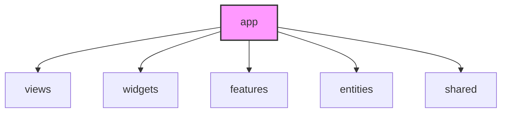

# App Layer (앱 레이어) 가이드

`app` 레이어는 애플리케이션의 **최상단 진입점 및 전역적인 설정(Config)**을 처리하는 곳입니다.
Next.js App Router 프로젝트의 경우, 이 폴더의 라우팅 구조와 루트 레이아웃 및 각종 글로벌 초기화 코드가 여기에 해당합니다.

---

## 💡 핵심 개념 및 설계 철학

`app` 레이어는 프레임워크와 애플리케이션을 바인딩하는 최외곽 껍데기입니다. 비즈니스 로직을 직접 수행하기보다는 아래와 같은 **글로벌 인프라 설정**을 조율합니다.

* **무엇이 들어오는가?**
  * **라우트 디렉토리 및 진입점**: Next.js App Router의 폴더 기반 라우팅 (`app/rooms/[id]/page.tsx` 등)
  * **전역 설정 및 초기화**: 글로벌 CSS 스타일링 (`globals.css`), 폰트 정의
  * **글로벌 프로바이더 (Global Providers)**: React Query Client Provider, Zustand Hydration, Theme Provider 등 애플리케이션 전체를 감싸는 Context Provider
  * **최상위 레이아웃**: 공통 HTML 틀과 메타데이터 설정 (`layout.tsx`, `metadata`)

---

## 📂 폴더 및 파일 구조

```text
app/
├── globals.css         # 글로벌 CSS 스타일 및 Tailwind 설정
├── layout.tsx          # 애플리케이션 최상위 HTML 구조 및 글로벌 프로바이더 조립
├── page.tsx            # 메인 루트 화면 진입점 (Views 레이어의 메인 페이지 컴포넌트 렌더링)
├── page.test.tsx       # E2E 혹은 통합 테스트
├── providers.tsx       # [선택] 전역 Context Provider들을 한 곳에 모은 래퍼 컴포넌트
└── rooms/              # Next.js App Router의 각 URL별 디렉토리
    └── [roomId]/
        └── page.tsx    # 해당 라우트의 진입점
```

---

## ⚠️ 참조 규칙 (Dependency Rules)



1. **최상위 레이어의 권한**
   * **허용**: `app` 레이어는 애플리케이션의 모든 하위 레이어(`views`, `widgets`, `features`, `entities`, `shared`)의 요소를 자유롭게 가져다 쓸 수 있습니다.
2. **역참조 절대 금지 (중요)**
   * **금지**: 하위의 어떤 레이어(예: `shared`, `entities`, `features`, `widgets`, `views`)도 `app` 폴더 내부에 있는 파일을 `import`해서는 안 됩니다.
   * **이유**: `app` 레이어는 프레임워크 종속적인 환경 설정(Next.js 설정 등)이 많아 하위 레이어에서 이를 import하면 결합도가 비정상적으로 높아지고 순환 참조 에러가 발생합니다.

---

## 🛠️ 실무 예시 (Example: Next.js 라우트 정의 및 전역 프로바이더)

애플리케이션 최상단 진입점이자 라우팅 경로를 지정하는 `app` 레이어의 구현 예시입니다. 
Next.js App Router의 `page.tsx`는 껍데기 역할을 하며, 실제 UI와 배치는 `views` 레이어의 컴포넌트를 사용합니다.

### 1. 폴더 구조
```text
app/
├── login/
│   └── page.tsx                    # /login 경로의 Next.js 라우팅 진입점
├── providers.tsx                   # 전역 Provider 설정 (React Query 등)
└── layout.tsx                      # 글로벌 레이아웃
```

### 2. 코드 구현

#### ① 라우팅 페이지 (`app/login/page.tsx`)
```tsx
import { LoginPage } from '@/views/login'; // views 레이어 참조 가능

export default function Page() {
  // Next.js App Router 페이지 컴포넌트에서는 껍데기 역할만 수행하고,
  // 실제 화면 렌더링은 views 레이어의 컴포넌트로 완전히 위임합니다.
  return <LoginPage />;
}
```

#### ② 글로벌 프로바이더 (`app/providers.tsx`)
```tsx
'use client';

import { QueryClient, QueryClientProvider } from '@tanstack/react-query';
import { useState } from 'react';

export function Providers({ children }: { children: React.ReactNode }) {
  const [queryClient] = useState(() => new QueryClient({
    defaultOptions: {
      queries: {
        refetchOnWindowFocus: false,
        retry: false,
      },
    },
  }));

  return (
    <QueryClientProvider client={queryClient}>
      {children}
    </QueryClientProvider>
  );
}
```

#### ③ 최상위 레이아웃 (`app/layout.tsx`)
```tsx
import { Providers } from './providers';
import './globals.css';

export default function RootLayout({ children }: { children: React.ReactNode }) {
  return (
    <html lang="ko">
      <body>
        <Providers>
          {children}
        </Providers>
      </body>
    </html>
  );
}
```

---

## 🚨 자주 발생하는 안티 패턴 (Anti-Patterns)

| 안티 패턴 | 문제점 | 해결 방안 |
| :--- | :--- | :--- |
| **`app/page.tsx` 내부에서 복잡한 API 호출 및 수십 개의 State 관리** | 비즈니스 로직과 물리적 라우팅 설정이 강하게 결합됨 | 비즈니스 가치가 담긴 화면 전체 조립은 `views` 레이어로 옮기고, `app/page.tsx`는 이를 가져다 렌더링만 하도록 작성합니다. |
| **하위 레이어(예: `widgets/header`)에서 `app` 레이어의 특정 파일이나 스타일을 import** | 역참조 및 순환 의존성 발생으로 모듈 독립성 훼손 | 공통 환경 설정이나 필요한 유틸리티는 `shared` 레이어로 옮겨서 참조하도록 설계합니다. |
| **모든 복잡한 전역 모달 상태를 `app` 레이아웃에 직접 선언** | 레이아웃 코드 비대화 및 리렌더링 문제 유발 | 모달의 트리거와 상태 관리는 `entities` 또는 `features` 레이어로 상태를 쪼개고, 전역 모달 컨테이너는 상태 라이브러리(Zustand 등)를 활용해 독립적으로 제어합니다. |
