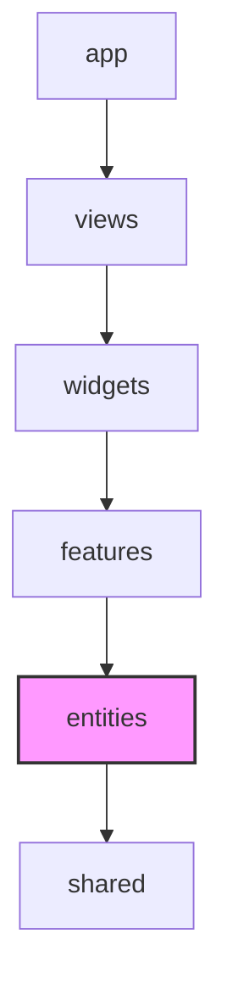

# Entities Layer (엔티티 레이어) 가이드

`entities` 레이어는 **비즈니스 도메인의 핵심 개념(개체)과 관련된 상태, 데이터 타입 및 단순 렌더링 컴포넌트**를 보관하는 곳입니다.
스스로 독립적인 행동(액션)을 개시하지 않고, 비즈니스 데이터를 표현하고 들고 있는 "수동적이고 개념적인 데이터 영역"입니다.

---

## 💡 핵심 개념 및 설계 철학

`entities`는 애플리케이션의 **"명사(Noun)"**와 같습니다.

* **무엇이 들어오는가?**
  * 도메인 데이터 인터페이스 및 타입 정의 (`model/types.ts`)
  * 도메인의 데이터를 저장하고 동기화하는 Zustand 스토어 (`model/store.ts` 또는 `model/slices.ts`)
  * 데이터를 받아서 정적으로 표시만 하는 순수 UI 컴포넌트 (`ui/`)
* **Features 레이어와의 경계**
  * `entities`에 속한 컴포넌트는 사용자의 상호작용으로 인해 서버에 데이터를 전송하거나 상태를 임의로 크게 변형하는 비즈니스 액션을 직접 호출하지 않습니다.
  * 예를 들어, 유저의 정보를 보여주는 프로필 아바타 UI(`entities/user/ui/Avatar.tsx`)는 엔티티이지만, "프로필 이미지 수정 버튼을 클릭하여 서버에 업로드하는 버튼 및 API 훅"은 피처(`features/user-profile-edit`)로 분리합니다.

---

## 📂 폴더 및 파일 구조 (Slices & Segments)

각 도메인(개체) 단위의 **슬라이스(Slice)**로 폴더를 생성하고, 내부의 역할별 **세그먼트(Segment)**로 구분하여 관리합니다.

```text
entities/
└── user/                       # 엔티티 슬라이스 (예: 유저 도메인)
    ├── model/                  # 타입 선언 및 Zustand 스토어
    │   ├── types.ts            # User 타입 인터페이스
    │   └── store.ts            # 현재 로그인한 유저 정보를 지닌 Zustand 스토어
    ├── ui/                     # 유저 데이터를 표현하는 정적 UI 컴포넌트
    │   ├── Avatar.tsx          # 프로필 아바타 컴포넌트
    │   └── Avatar.test.tsx
    └── index.ts                # Public API (외부에 공개할 항목만 export)
```

---

## ⚠️ 참조 규칙 (Dependency Rules)



1. **단방향 참조 (위에서 아래로)**
   * **허용**: `entities`는 오직 하위 레이어인 `shared`만 참조(`import`)할 수 있습니다.
   * **금지**: 상위 레이어인 `features`, `widgets`, `views`, `app`은 절대 참조할 수 없습니다. (예: `entities` 컴포넌트가 `features`에서 제공하는 API 요청 훅을 임포트하는 행위 금지)
2. **동일 레이어 참조 금지 (Cross-Slice Isolation)**
   * 서로 다른 엔티티 슬라이스끼리 직접 의존해서는 안 됩니다.
   * **금지**: `entities/chat`에 있는 컴포넌트나 스토어에서 `entities/user`에 있는 아바타 컴포넌트나 유저 스토어를 직접 `import`하는 행위.
   * **해결책**: 만약 유저 정보가 포함된 채팅 메시지 화면이 필요하다면, 상위 레이어인 `widgets`나 `features`에서 두 엔티티를 불러와 결합(Composition)해야 합니다.

---

## 🛠️ 실무 예시 (Example: User 엔티티)

사용자(User) 정보를 다루는 `entities/user` 슬라이스의 구현 예시입니다. 
이 엔티티는 사용자 데이터의 구조(Type)와 상태(Store), 그리고 데이터를 정적으로 렌더링하는 순수 UI 컴포넌트로 구성됩니다.

### 1. 폴더 구조
```text
entities/
└── user/                           # 유저 도메인 엔티티 슬라이스
    ├── model/
    │   ├── types.ts                # 유저 데이터 타입 정의
    │   └── store.ts                # 유저 로그인 상태를 관리하는 Zustand 스토어
    ├── ui/
    │   └── Avatar.tsx              # 유저 프로필 이미지를 렌더링하는 UI 컴포넌트
    └── index.ts                    # Public API (외부에는 타입, 스토어, UI 컴포넌트만 export)
```

### 2. 코드 구현

#### ① 타입 정의 (`model/types.ts`)
```typescript
export interface User {
  id: string;
  email: string;
  nickname: string;
  avatarUrl?: string;
}
```

#### ② 상태 관리 스토어 (`model/store.ts`)
```typescript
import { create } from 'zustand';
import { User } from './types';

interface UserStore {
  currentUser: User | null;
  setCurrentUser: (user: User) => void;
  clearCurrentUser: () => void;
}

export const useUserStore = create<UserStore>((set) => ({
  currentUser: null,
  setCurrentUser: (user) => set({ currentUser: user }),
  clearCurrentUser: () => set({ currentUser: null }),
}));
```

#### ③ UI 컴포넌트 (`ui/Avatar.tsx`)
```tsx
import { User } from '../model/types';

interface AvatarProps {
  user: User;
  size?: 'sm' | 'md' | 'lg';
}

export const Avatar = ({ user, size = 'md' }: AvatarProps) => {
  const sizeClasses = {
    sm: 'w-8 h-8',
    md: 'w-10 h-10',
    lg: 'w-12 h-12',
  };

  return (
    
  );
};
```

### 3. Public API (`index.ts`)
```typescript
export type { User } from './model/types';
export { useUserStore } from './model/store';
export { Avatar } from './ui/Avatar';
```

---

## 🚨 자주 발생하는 안티 패턴 (Anti-Patterns)

| 안티 패턴 | 문제점 | 해결 방안 |
| :--- | :--- | :--- |
| **`entities/user` 컴포넌트 내부에 회원가입 API(`/api/signup`) 호출 훅을 선언** | 수동적인 데이터 모델이어야 할 엔티티가 구체적인 기능 비즈니스 액션과 결합되어 재사용이 어려워짐 | API를 호출하는 폼이나 버튼 요소는 `features/auth` 레이어로 이동하고, `entities`는 데이터 상태만 보관하도록 분리합니다. |
| **`entities/chat`의 메시지 말풍선 내부에서 `entities/user` 유저 아바타를 직접 import** | 엔티티 간의 강한 상호 참조로 인해 두 슬라이스를 별도로 분리하여 테스트/재사용할 수 없음 | `entities/chat` 컴포넌트는 `children`을 전달받을 수 있게 설계(Slot 패턴)하고, 상위 레이어인 `widgets/chatWindow`에서 `<MessageBubble senderAvatar={<Avatar user={user} />} />` 형태로 조립해 줍니다. |
| **Zustand 대신 모든 데이터를 `shared/context`에 넣고 사용** | 아키텍처 규칙 상 비즈니스 도메인 데이터(유저, 방 등)는 `entities` 레이어에 보관되어야 모듈성이 올라갑니다. | 도메인 데이터 상태 스토어는 반드시 `entities/{domain}/model` 영역에 위치시킵니다. |
