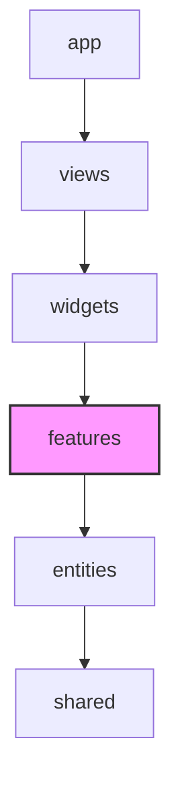

# Features Layer (피처 레이어) 가이드

`features` 레이어는 **사용자의 액션, 상호작용 및 실질적인 비즈니스 기능(행위)**을 다루는 아키텍처 레이어입니다.
단순히 데이터를 보여주는 것(`entities`)을 넘어, 데이터를 변경하거나 시스템과 상호작용하는 구체적인 행위(Action) 중심의 코드가 이 레이어에 포함됩니다.

---

## 💡 핵심 개념 및 설계 철학

FSD(Feature-Sliced Design) 아키텍처에서 `features`는 애플리케이션의 **"행동 지침"**을 정의합니다.

* **무엇이 들어오는가?**
  * 서버의 상태를 변경하는 API 요청 (Mutation - 데이터 생성, 수정, 삭제)
  * 실시간 소켓 이벤트 전송 및 수신 처리
  * 폼(Form) 입력 제어 및 제출 로직
  * 로컬 상태 변경을 유도하는 인터랙티브 UI 요소 (예: 토글 버튼, 드롭다운 메뉴, 모달 열기 버튼 등)
* **Entities 레이어와의 차이점**
  * `entities/room`은 "방 데이터의 구조(Type)"와 "방 카드의 정적 스타일(UI)"을 정의합니다.
  * `features/room`은 사용자가 "방 생성 버튼을 클릭했을 때 API를 호출하고 소켓 이벤트를 발행하는 동작"을 정의합니다.

---

## 📂 폴더 및 파일 구조 (Slices & Segments)

각 피처는 도메인 또는 기능 단위의 **슬라이스(Slice)**로 폴더를 생성하고, 내부의 역할별 **세그먼트(Segment)**로 구분하여 관리합니다.

```text
features/
└── chat/                       # 피처 슬라이스 (예: 채팅 기능)
    ├── api/                    # [선택] 해당 피처 전용 API 요청 함수 (Orval 생성 파일 등)
    │   └── sendChatMessage.ts
    ├── model/                  # [선택] 상태 및 비즈니스 로직 (Zustand, React Query 커스텀 훅)
    │   └── useSendChatMessage.ts
    ├── ui/                     # [선택] 상호작용이 포함된 컴포넌트
    │   ├── ChatInput.tsx       # 메시지 입력창 + 전송 버튼 UI
    │   └── ChatInput.test.tsx  # 컴포넌트 테스트 코드
    └── index.ts                # Public API (외부에 공개할 항목만 export)
```

> [!TIP]
> 모든 하위 파일들을 외부 레이어에서 직접 `import`하지 않고, 슬라이스 루트의 `index.ts`를 거쳐서 참조하도록 통제해야 의존성 관리가 투명해집니다. (Public API 패턴)

---

## ⚠️ 참조 규칙 (Dependency Rules)

아키텍처의 견고함을 유지하기 위해 반드시 아래 규칙을 준수해야 합니다.



1. **단방향 참조 (위에서 아래로)**
   * **허용**: `features`는 자신보다 하위 레이어인 `entities`와 `shared`만 참조(`import`)할 수 있습니다.
   * **금지**: 상위 레이어인 `widgets`, `views`, `app`은 절대 참조할 수 없습니다. (예: `features` 내에서 헤더 컴포넌트나 페이지 전체 컴포넌트를 가져오면 안 됨)
2. **동일 레이어 참조 금지 (Cross-Slice Isolation)**
   * 서로 다른 피처 슬라이스끼리 직접 의존해서는 안 됩니다.
   * **금지**: `features/room`에 있는 컴포넌트가 `features/auth`에 있는 로그인 함수를 직접 `import`하는 행위.
   * **해결책**: 두 기능의 결합이 필요할 경우, 상위 레이어인 `widgets`나 `views`에서 두 개의 피처를 조립하거나 콜백 함수(`onSuccess` 등)를 통해 데이터를 전달해야 합니다.

---

## 🚨 자주 발생하는 안티 패턴 (Anti-Patterns)

| 안티 패턴 | 문제점 | 해결 방안 |
| :--- | :--- | :--- |
| **피처 컴포넌트에서 `widgets` 레이어를 import** | 순환 의존성 발생 및 아키텍처 규칙 위반 | 피처는 독립적인 기능 단위여야 합니다. `widgets`에서 해당 피처를 자식 컴포넌트로 전달받거나(Composition), 조립하여 해결합니다. |
| **`features/auth`에서 `features/room`을 import** | 피처 슬라이스 간의 강한 결합 발생, 코드 재사용성 저하 | 두 행동이 묶이는 로직을 상위 레이어(`widgets` 등)에서 핸들러 조립을 통해 처리합니다. |
| **비즈니스 상태를 담지 않는 순수 Input 컴포넌트를 제작** | UI 스타일 가이드의 파편화 및 재사용 불가 | 비즈니스 종속성이 없고 재사용 가능한 단순 텍스트 입력창은 `shared/ui/input`으로 분리합니다. |
