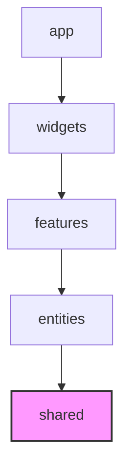

# Shared Layer (공유 레이어) 가이드

`shared` 레이어는 **비즈니스 도메인 규칙을 전혀 모르며, 어떤 프로젝트에서도 즉시 가져다 재사용할 수 있는 범용 리소스와 인프라**가 들어가는 최하위 레이어입니다.
프로젝트의 기초 뼈대가 되는 공통 UI 컴포넌트, 유틸리티 함수, API 및 소켓 인스턴스 설정 등이 여기에 속합니다.

---

## 💡 핵심 개념 및 설계 철학

`shared` 레이어는 애플리케이션 전체의 **"유틸리티 상자 및 기초 인프라"** 역할을 수행합니다.

* **무엇이 들어오는가?**
  * **순수 공통 UI 컴포넌트 (`shared/ui`)**: 특정 비즈니스와 결합하지 않은 범용 컴포넌트 (예: `Button`, `Input`, `Modal`, `Spinner`)
  * **API 인프라 설정 (`shared/api`)**: Axios 인스턴스, 공통 에러 핸들링 인터셉터, Fetch 래퍼 등
  * **공통 라이브러리 및 유틸리티 (`shared/lib`)**: 테일윈드 클래스 병합 유틸(`cn`), 웹소켓 클라이언트 설정, 날짜 포맷 함수, 범용 커스텀 훅
  * **테스트 인프라 (`shared/testing`)**: Vitest 셋업, MSW 모의 서비스 워커 공통 핸들러 등
* **비즈니스 무지(Domain Ignorance)**
  * `shared` 폴더 밑의 코드에는 절대 'User', 'Room', 'Chat', 'Game' 등 애플리케이션의 특정 비즈니스 용어나 타입이 기재되지 않아야 합니다.

---

## 📂 폴더 및 파일 구조 (Slices & Segments)

`shared` 레이어는 대규모 구조를 지니지 않기 때문에 별도의 슬라이스(Slice) 폴더를 두지 않고, 바로 **세그먼트(Segment)** 폴더 단위로만 구성합니다.

```text
shared/
├── api/                        # HTTP API 공통 인스턴스 설정
│   └── apiClient.ts
├── lib/                        # 공통 유틸 및 소켓 인스턴스
│   ├── cn.ts                   # Tailwind 클래스 병합 함수
│   └── socket.ts               # Socket.io 클라이언트 설정
├── testing/                    # Vitest 등 테스트 설정 관련 파일
│   └── setupTests.ts
└── ui/                         # 도메인이 없는 범용 공통 UI 컴포넌트
    ├── button/
    │   ├── Button.tsx
    │   └── index.ts
    └── index.ts                # Shared UI 통합 export
```

---

## ⚠️ 참조 규칙 (Dependency Rules)



1. **역참조 절대 금지 (최하위 레이어)**
   * **금지**: `shared` 폴더 안의 파일들은 프로젝트의 어떤 상위 레이어(`app`, `widgets`, `features`, `entities`) 파일도 `import`할 수 없습니다.
   * **이유**: `shared`가 상위 레이어를 역참조하면 아키텍처 결합도가 폭발하며, 순환 의존성(Circular Dependency)으로 인해 모듈이 파괴됩니다.
2. **세그먼트 간의 참조 허용**
   * **허용**: `shared/ui/button`이 `shared/lib/cn.ts`에 정의된 클래스 병합 함수를 가져와 쓰는 형태는 하위 레이어 내에서의 정상적인 참조로 허용됩니다.

---

## 🛠️ 실무 예시 (Example: 공통 Input/Button UI 컴포넌트)

특정 비즈니스에 종속되지 않은 범용 UI 컴포넌트인 `shared/ui` 구현 예시입니다. 
이 컴포넌트들은 앱 내의 로그인 폼(`LoginForm` 위젯) 등 어느 곳에서나 가져다 재사용할 수 있도록 설계합니다.

### 1. 폴더 구조
```text
shared/
└── ui/
    ├── button/
    │   ├── Button.tsx              # 공통 버튼 컴포넌트
    │   └── index.ts
    ├── input/
    │   ├── Input.tsx               # 공통 입력 필드 컴포넌트
    │   └── index.ts
    └── index.ts                    # ui 세그먼트 통합 export
```

### 2. 코드 구현

#### ① 공통 Button 컴포넌트 (`ui/button/Button.tsx`)
```tsx
import { ButtonHTMLAttributes, ReactNode } from 'react';

interface ButtonProps extends ButtonHTMLAttributes<HTMLButtonElement> {
  children: ReactNode;
  variant?: 'primary' | 'secondary';
}

export const Button = ({ children, variant = 'primary', className = '', ...props }: ButtonProps) => {
  const baseStyle = 'px-4 py-2 rounded font-medium transition-colors disabled:opacity-50';
  const variantStyles = {
    primary: 'bg-blue-600 hover:bg-blue-700 text-white',
    secondary: 'bg-gray-200 hover:bg-gray-300 text-gray-800',
  };

  return (
    <button
      className={`${baseStyle} ${variantStyles[variant]} ${className}`}
      {...props}
    >
      {children}
    </button>
  );
};
```

#### ② 공통 Input 컴포넌트 (`ui/input/Input.tsx`)
```tsx
import { InputHTMLAttributes } from 'react';

interface InputProps extends InputHTMLAttributes<HTMLInputElement> {}

export const Input = ({ className = '', ...props }: InputProps) => {
  return (
    <input
      className={`w-full px-3 py-2 border rounded focus:outline-none focus:ring-2 focus:ring-blue-500 ${className}`}
      {...props}
    />
  );
};
```

### 3. Public API (`ui/index.ts`)
```typescript
export { Button } from './button/Button';
export { Input } from './input/Input';
```

---

## 🚨 자주 발생하는 안티 패턴 (Anti-Patterns)

| 안티 패턴 | 문제점 | 해결 방안 |
| :--- | :--- | :--- |
| **`shared/ui/button` 컴포넌트 내부에서 `entities/user` 스토어를 가져와 사용자의 권한별 버튼 스타일 제어** | 최하위 레이어의 역참조 위반 및 특정 도메인 결합 발생 | 버튼은 단순 스타일에 집중하고, 권한 제어 비즈니스 로직은 상위 레이어(`features` 등)에서 처리하여 버튼 컴포넌트에 `disabled` 속성을 내려줍니다. |
| **`shared/api` 파일에 `/api/rooms` 등 특정 도메인의 API 요청 주소와 비즈니스 데이터 처리 로직을 가득 기재** | 프로젝트 규모가 클수록 공통 모듈이 복잡해져 유지보수 곤란 | `shared/api`는 베이스 인스턴스 생성 및 공통 인터셉터 설정에만 집중하고, 각 엔드포인트 요청 훅은 해당 도메인의 `entities` 또는 `features` 내부 `api` 세그먼트에 분할 작성합니다. |
| **디자인 시스템이나 공통 UI가 없다는 이유로 모든 버튼을 각 페이지마다 직접 선언** | UI 일관성이 깨지고 마크업 변경 시 모든 코드를 수정해야 함 | 재사용 가능한 마크업 뼈대는 최대한 `shared/ui`로 설계하여 UI 재사용성을 유지합니다. |
