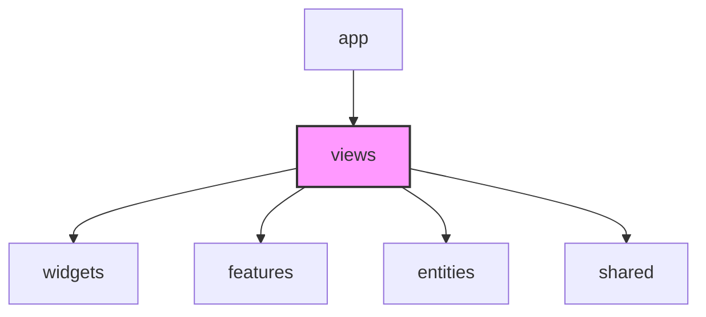

# Views Layer (FSD Pages) 가이드

`views` 레이어는 **각 URL 경로(라우트)에서 보게 될 전체 화면 컴포넌트**를 구성하는 곳입니다.
FSD 아키텍처의 공식 명칭은 `pages` 레이어이지만, Next.js App Router의 `app` 디렉토리와의 이름 충돌을 피하고 의도를 명확히 하기 위해 이 프로젝트에서는 `views` 레이어로 이름을 지정하여 사용합니다.

---

## 💡 핵심 개념 및 설계 철학

`views` 레이어는 애플리케이션의 화면 단위(View) 독립성을 보장합니다.

* **무엇이 들어오는가?**
  * 화면 전체 레이아웃 (예: 헤더, 사이드바, 메인 콘텐츠 영역 배치)
  * 다양한 `widgets`와 `features` 컴포넌트들의 조립체
  * URL 파라미터나 쿼리 스트링을 파싱하여 하위 위젯이나 피처에 전달하는 최상위 바인딩 컴포넌트
  * 해당 화면(예: 게임 룸 화면)에서만 쓰이는 단발성 전역 UI 조율 로직
* **Next.js `app` 디렉토리와의 관계**
  * Next.js의 `app/**/page.tsx` 파일은 오직 라우팅 경로만 지정하는 껍데기 파일입니다.
  * 실제 UI 및 컴포넌트 배치는 `views`의 해당 컴포넌트가 담당하며, `page.tsx`는 이 `views` 컴포넌트를 불러와 렌더링만 대행합니다.

---

## 📂 폴더 및 파일 구조 (Slices & Segments)

각 화면별로 슬라이스(Slice)를 생성하며, 세그먼트(Segment)가 필요 없을 만큼 작다면 루트의 컴포넌트로만 구성해도 무방합니다.

```text
views/
├── lobby/                     # 대기방 로비 화면 슬라이스
│   ├── ui/                    # [선택] 로비 전용 최상위 UI 컴포넌트
│   │   └── LobbyPage.tsx      # 로비 화면 전체 레이아웃 조립체
│   └── index.ts               # Public API
└── gameRoom/                  # 게임 방 화면 슬라이스
    ├── ui/
    │   └── GameRoomPage.tsx
    └── index.ts
```

---

## ⚠️ 참조 규칙 (Dependency Rules)



1. **단방향 참조 (위에서 아래로)**
   * **허용**: `views` 컴포넌트는 하위 레이어인 `widgets`, `features`, `entities`, `shared`에 정의된 리소스를 자유롭게 임포트하여 조립할 수 있습니다.
   * **금지**: 상위 레이어인 `app` 레이어는 절대 참조할 수 없습니다. (예: `views`에서 `app/layout.tsx`나 `app/providers.tsx` 등을 직접 가져와 쓰는 것은 금지)
2. **동일 레이어 참조 금지 (Cross-Slice Isolation)**
   * 서로 다른 `views` 컴포넌트끼리 직접 `import`해서 결합하면 안 됩니다.
   * **금지**: `views/gameRoom/ui/GameRoomPage.tsx`에서 `views/lobby/ui/LobbyPage.tsx`를 가져와 일부분으로 렌더링하는 행위. (재사용이 필요한 영역이라면 `widgets`나 `shared`로 내려보낸 후 각 페이지에서 가져와야 함)

---

## 🚨 자주 발생하는 안티 패턴 (Anti-Patterns)

| 안티 패턴 | 문제점 | 해결 방안 |
| :--- | :--- | :--- |
| **`views` 컴포넌트 내부에 수백 줄의 API 요청, 소켓 로직 등을 전부 모아두는 경우** | 화면 레이아웃과 구체적인 비즈니스 구현이 결합하여 가독성 저하 및 재사용이 불가능해짐 | 비즈니스 로직과 상호작용은 `features` 또는 `entities` 레이어로 이관하고, `views`는 이를 받아 배치하는 껍데기로 활용합니다. |
| **`views` 내부의 슬라이스 컴포넌트를 다른 `views`에서 import하는 경우** | 라우트 단위 간의 강한 결합 발생으로 의존성 구조 복잡화 | 두 화면이 공유해야 하는 UI 요소나 로직은 `widgets`나 `shared`로 격하시키고, 각 `views`는 최하위 공통 요소를 직접 조립합니다. |
| **App Router의 `app/**/page.tsx`에 이 폴더의 내용을 전부 기재하는 경우** | FSD 아키텍처 의도가 손상되고 프레임워크 결합성이 높아짐 | `app/page.tsx`는 라우팅 진입 역할만 맡고, 화면을 담당하는 코드와 컴포넌트 분리는 반드시 `views` 폴더 내에서 이루어지도록 엄격히 준수합니다. |
