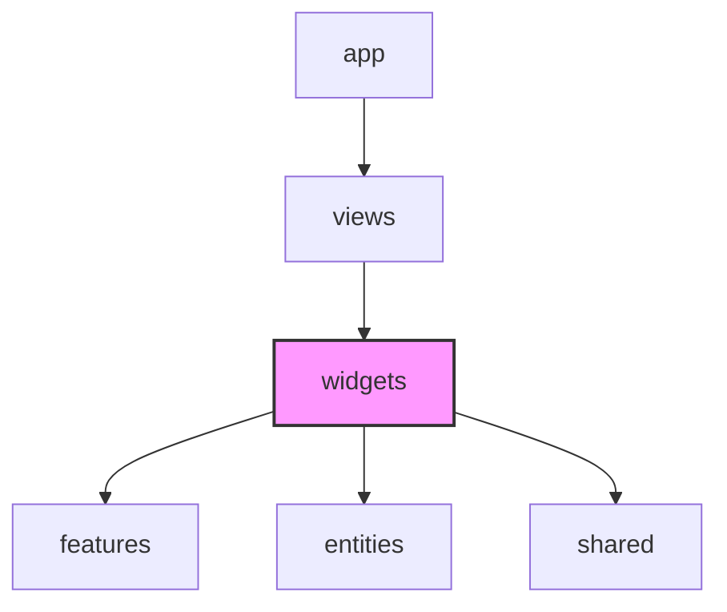

# Widgets Layer (위젯 레이어) 가이드

`widgets` 레이어는 **독립적으로 기능하며 화면에서 특정 의미 있는 영역을 완성하는 컴포넌트 블록**입니다.
단순 UI 조각들을 조립하고 비즈니스 액션(`features`)과 도메인 데이터(`entities`)를 결합하여, 독자적으로 동작할 수 있는 "자립식 컴포넌트"를 개발하는 레이어입니다.

---

## 💡 핵심 개념 및 설계 철학

`widgets`는 화면의 레이아웃을 구성하는 가장 중요한 **조립식 모듈(유닛)**입니다.

* **무엇이 들어오는가?**
  * 여러 `entities`와 `features`가 결합된 커다란 컴포넌트 블록 (예: 헤더 네비게이션 바, 게임 대기판, 독립형 채팅 위젯)
  * 특정 UI 영역의 데이터 요청 및 상태 조율을 전담하는 컨테이너
  * 예: `ChatWindow` 위젯 = `entities/chat`(메시지 말풍선 리스트 UI) + `features/chat`(메시지 전송 폼 UI 및 API 요청)의 결합체
* **재사용성과 비즈니스 결합의 균형**
  * `shared/ui`는 도메인을 전혀 모르는 순수한 컴포넌트(버튼, 모달)인 반면, `widgets`는 우리 앱의 비즈니스 지식(유저 데이터, 채팅 기능 등)을 완전하게 포함하고 있습니다.
  * 여러 페이지(`views`)에서 중복해서 사용할 수 있지만, 한 페이지 내에서 단 한 번만 사용되더라도 논리적인 하나의 큰 영역을 담당한다면 `widgets`로 분류합니다.

---

## 📂 폴더 및 파일 구조 (Slices & Segments)

각 위젯은 기능 또는 영역 단위의 **슬라이스(Slice)**로 폴더를 구성합니다.

```text
widgets/
├── chatWindow/                 # 채팅창 영역 위젯 슬라이스
│   ├── ui/                     # 위젯 UI 조립 컴포넌트
│   │   └── ChatWindow.tsx      # 메시지 리스트와 입력창을 조립한 파일
│   └── index.ts                # Public API
└── header/                     # 공통 헤더 위젯 슬라이스
    ├── ui/
    │   └── Header.tsx
    └── index.ts
```

---

## ⚠️ 참조 규칙 (Dependency Rules)



1. **단방향 참조 (위에서 아래로)**
   * **허용**: `widgets`는 하위 레이어인 `features`, `entities`, `shared`에 구현된 컴포넌트와 훅을 자유롭게 참조할 수 있습니다.
   * **금지**: 상위 레이어인 `views`, `app` 레이어는 결코 참조할 수 없습니다. (예: `widgets` 내부에서 `views/lobbyPage.tsx` 등을 임포트하는 행위 금지)
2. **동일 레이어 참조 금지 (Cross-Slice Isolation)**
   * **금지**: 서로 다른 `widgets`끼리 서로를 `import`하여 의존성을 형성해서는 안 됩니다.
   * **예시**: `widgets/sidebar` 컴포넌트가 `widgets/header` 컴포넌트를 직접 호출하는 행위. 두 위젯의 결합이 필요할 경우, 상위 레이어인 `views`에서 두 위젯을 나란히 배치해야 합니다.

---

## 🚨 자주 발생하는 안티 패턴 (Anti-Patterns)

| 안티 패턴 | 문제점 | 해결 방안 |
| :--- | :--- | :--- |
| **`widgets` 컴포넌트 내부에서 상위인 `views` 컴포넌트를 import** | 순환 의존성이 발생하고, 특정 화면에 위젯이 기형적으로 종속됨 | 해당 위젯의 바깥 구도나 페이지 전환 로직은 상위 `views` 레이어로 위임하고 콜백 함수를 통해 알림만 보냅니다. |
| **`widgets/sidebar`가 `widgets/header`를 직접 가져와 내부에 렌더링함** | 위젯 간의 커플링으로 인해 개별 위젯을 독립적으로 재사용하거나 격리 테스트하기 어려워짐 | 상위 레이어(`views` 등)에서 사이드바와 헤더를 평등한 형제 노드로 각각 선언하고 레이아웃을 잡습니다. |
| **비즈니스 상태가 없고, 재사용성이 불가능하게 특정 디자인만 입힌 단순 버튼을 `widgets`에 방치** | 폴더 구조가 비대해지고 정작 중요한 핵심 위젯의 가시성을 흐림 | 순수 스타일 중심의 컴포넌트는 `shared/ui`로 이동하여 프로젝트 전반에서 일관되게 공유될 수 있게 변경합니다. |
